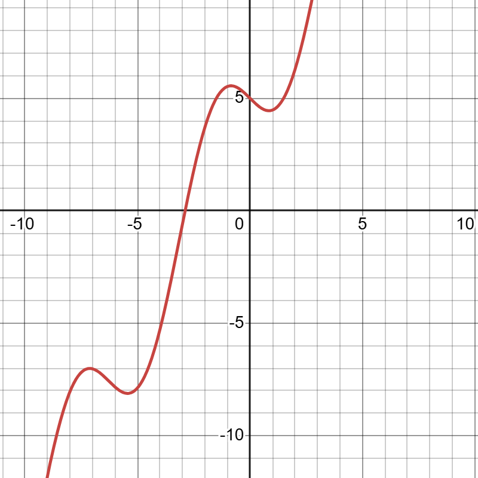

# CATAM-0.1-root-finding-in-one-dimension

A rewrite of my Cambridge CATAM undergraduate project, "Root finding in one dimension".

## Rust

This project is written in [Rust](https://www.rust-lang.org/), which is a highly performant compiled language with memory management. For this project, where we may manipulate large volumes of data, performance is prioritised. Rust is a multi-paradigm language, supporting object-oriented, functional and data-oriented designs. This project mostly follows a functional design - after all, we're attempting to study properties of functions - with some object-oriented aspects.

## The project

The aim of this project is to study iteration methods for the numerical solution of an algebraic
or transcendental equation $F(x) = 0$.

### Test functions

We focus on three main example functions:
- $F(x)=x$, with a simple root at $x=0$;
- $F(x)=2x-3\sin(x)+5$, with a simple root at $x\approx -2.88$; and
- $F(x)=x^3-8.5x^2+20x-8=(x-\frac{1}{2})(x-4)^2$, with a simple root at $x=\frac{1}{2}$ and a repeated root at $x=4$.

These functions are very well-behaved (they are [smooth](https://en.wikipedia.org/wiki/Smoothness), have bounded 3rd derivative, etc.), but only some of these nice properties are used in each iteration method.

These functions are implemented in the ```test_functions``` module as ```identity```, ```trig``` and ```polynom``` respectively.

### Binary search

The binary search algorithm is based on Bolzano's Theorem, a special case of the [Intermediate Value Theorem](https://en.wikipedia.org/wiki/Intermediate_value_theorem). In short, if a continuous function $F$ changes sign in an interval $[a,b]$, then it must have a root in the interval. Taking the midpoint $m=\frac{a+b}{2}$, and considering the sign of $F(m)$, we can determine if the root is in $[a,m]$ or $[m,b]$. Repeating this process, we can locate the root to arbitrary precision.

A binary search will locate any simple root on any continuous function with a linear [rate of convergence](https://en.wikipedia.org/wiki/Rate_of_convergence).

We implement this algorithm as ```root_search::binary```.

### Fixed point iteration

[Fixed point iteration](https://en.wikipedia.org/wiki/Fixed-point_iteration) is a method for finding fixed points for some function $f$, that is, values for which $f(x)=x$. 

The sequence $x_{N+1}=f(x_N)$ may be convergent or divergent for a given starting value $x_0$. If it is convergent, then by [sequential continuity](https://en.wikipedia.org/wiki/Continuous_function#Definition_in_terms_of_limits_of_sequences) of $f$, the limit $x_*$ will be a fixed point of $f$.

When this method is convergent, it is at least linearly convergent for simple roots.

We implement a fixed point iteration algorithm as ```root_search::fixed_point```.

### A nice class of functionals for fixed-point iteration

If $\Gamma$ is any functional such that $\Gamma(F)(x)=0$ exactly when $F(x) = 0$, then roots of $F$ correspond to fixed points of $f(x) = x - \Gamma(F)(x)$. We can thus leverage our fixed-point iteration algorithm to find roots of $F$. Picking $\Gamma$ carefully is key to both avoiding divergence, and to having a fast rate of convergence.

Two choices of $\Gamma$ are implemented as functionals in our program.

- $\Gamma(F) = \frac{F}{2+k}$ is implemented as `functional::frac`.

- $\Gamma(F) = \frac{F}{F'}$, where $F'$ is the derivative of $F$, is implemented as `functional::newton_raphson`. $F'$ must be manually defined and passed as an input.

Some specific methods, like the Newton-Raphson method, have better convergence. These often depend on properties like differentiability, so are not always an appropriate choice.

## Problems

The original CATAM project involved certain explicit questions and problems, which are reproduced (and solved) here.

### Problem one: 

Show, with the help of a graph, that $F(x) = 2x - 3sin(x) + 5$ has exactly one root.

#### Solution: 

We can see that $2x + 8 = 2x + 3 + 5 \ge F(x) \ge 2x - 3 + 5 = 2x + 2$, since $1 \ge sin(x) \ge -1$. So $F(x)<0$ when $x<-4$, and $F(x)>0$ when $x>-1$. Graphing $F$ in the range $-4 \le x \le -1$, we can see there is exactly one root:



---

### Problem two:

Write an implementation of binary search

#### Solution:

Implemented in `root_search::binary`.

---

### Problem three:

Write an implementation of fixed-point iteration.

#### Solution:

Implemented in `root_search::fixed_point`.

---

### Problem four:

Use fixed-point iteration to find the root of $F$ by taking the transform $f = x - \Gamma(F) = x - \frac{F}{2+k}$.

1. First, run the program with $k = 0$, a truncation error of $10^{-5}$, $x_0 = -2$, and $N_{max}=10$. Plot $y = f(x)$ and $y = x$ on the same graph, and use these plots to show why convergence should not occur. Explain the divergence by identifying a theoretical criterion that has been violated.

2. Determine the values of $k$ for which convergence is guaranteed if $x_N$ remains in the range $(−\pi, −\pi/2)$.

3. Choose, giving reasons, a value of $k$ for which monotonic convergence should occur near the root, and also a value for which oscillatory convergence should occur near the root. Verify that these two values of $k$ give the expected behaviour, by running the program with $N_{max} = 20$. 

4. Also run the case $k = 16$. This should converge only slowly, so set $N_{max} = 50$.

5. Discuss whether your results are consistent with first-order convergence.

#### Solution:

For the whole of this question, we use the following code in `main.rs`, varying our parameters and making minor modifications as needed:
```rust
fn main() {
    let initial_func: &ContinuousFunction = &(test_function::trig as fn(f64) -> f64);
    let k: f64 = 0.0;
    let initial_val: f64 = -2.0;
    let trunc_err: f64 = 1.0/pow(10.0, 5);
    let max_iter: usize = 10;

    let transformed_func: Box<ContinuousFunction> = functional::x_minus(functional::frac(&initial_func, &k));
    let (mut res, _seq) = root_search::fixed_point(&transformed_func, initial_val, trunc_err, max_iter);
    res = (res/trunc_err).round()*trunc_err;
    println!("Root is at {} ± {}", res, trunc_err);
}
```

1. Running our code with the given parameters, a root is reported at -3.9749 ± 0.00001. From our previous work, we know this isn't correct. The true root should be between -3 and -2. In fact, a binary search reveals the root is at $x \approx -2.8832$.

---